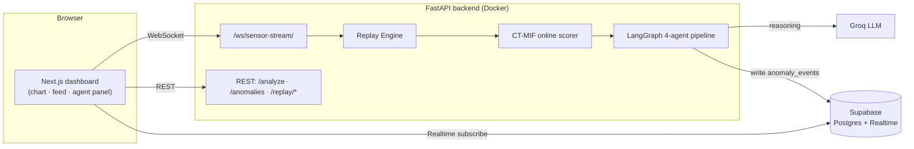
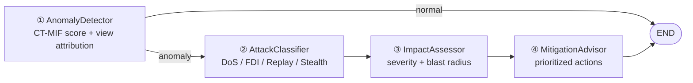

# CT-MIF Production System

> Productionized **CT-MIF** (multi-view Isolation-Forest anomaly detection) for the
> SWaT industrial water-treatment testbed, wrapped in a **4-agent LangGraph reasoning
> pipeline** (classify → assess → mitigate), a **FastAPI WebSocket sensor stream**, a
> **Supabase** event store with Realtime broadcasting, a controllable **Replay Engine**,
> and a **Next.js** dashboard. Packaged as a Docker image with **GitHub Actions CI/CD**.

---

## Architecture



**Agent pipeline** (downstream agents run only on a confirmed anomaly):



---

## Stack

| Layer | Tech |
|---|---|
| Core ML | CT-MIF — 3-view Isolation Forest + score fusion (`pp.py`, `train.py`, `test.py`) |
| Online inference | `core/ctmif.py` — causal, one-reading-at-a-time scorer (verified bit-exact vs offline) |
| Agents | LangGraph, 4 agents on **Groq** (`langchain-groq`), heuristic fallback |
| Backend | FastAPI (REST + WebSocket) |
| Database | Supabase (PostgreSQL + Realtime) |
| Frontend | Next.js (App Router) + Recharts + `@supabase/supabase-js` |
| DevOps | Docker (backend image), GitHub Actions CI/CD → GHCR |

---

## Repository layout

```
core/ctmif.py          Online CT-MIF scorer (rolling buffers; reproduces training pipeline causally)
pp.py train.py test.py  Existing CT-MIF training/eval (preprocess → 3-view IF → fuse → threshold)
agents/                4 agents + LangGraph graph + SWaT domain knowledge
api/                   FastAPI app, routes (analyze / anomalies / stream), Supabase client
replay/engine.py       Seekable "live" stream: play/pause/speed/jump + debounced events
frontend/              Next.js dashboard (2 pages: live dashboard + anomaly history)
tests/                 pytest: scorer, API, agents, replay (16 tests)
scripts/               extract_sample · build_replay_data · diag_detector · live_test
db/supabase_setup.sql  Schema + Realtime + RLS read policy
Dockerfile             Backend container image (built + pushed to GHCR by CI)
.github/workflows/     ci.yml (pytest + next build) · docker.yml (image → GHCR on tag)
```

---

## Quickstart

### 1. Backend

```bash
python -m venv .venv && . .venv/Scripts/activate   # Windows; use bin/activate on *nix
pip install -r requirements.txt
cp .env.example .env        # fill SUPABASE_*, GROQ_API_KEY
```

Trained models live in `artifacts/*.pkl` (committed). To regenerate from the raw dataset:

```bash
python pp.py data/swat_combined.csv     # preprocess (writes artifacts/, incl. scaler/freq)
python train.py                         # train 3 Isolation Forests + thresholds
python scripts/build_replay_data.py     # optional: full 35-attack replay file
```

> **Windows note:** prefix scripts with `PYTHONIOENCODING=utf-8` — the console's cp1252
> codec chokes on the Unicode in some print statements.

Run the API:

```bash
uvicorn api.main:app --reload        # http://localhost:8000/docs
```

### 2. Supabase

In the Supabase SQL editor, run [`db/supabase_setup.sql`](db/supabase_setup.sql). It creates
the tables, enables Realtime on `anomaly_events`, and adds the **anon read policy** the
browser needs (without it, RLS makes anon reads return `[]` and Realtime stays silent).

### 3. Frontend

```bash
cd frontend
npm install
cp .env.local.example .env.local     # API URLs + Supabase anon key (browser-safe)
npm run dev                          # http://localhost:3000
```

---

## The CT-MIF detector

`train.py` builds three Isolation-Forest "views" — raw+temporal sensor features (View A),
PCA + actuator-state surprise (View B), and step-over-step change (View C) — then fuses,
smooths, and thresholds their normalized scores.

`core/ctmif.py` reproduces that pipeline **causally**, one reading at a time, using rolling
buffers for the 60-row rolling-std, the step-difference, and the smoothing window. It is
**verified bit-exact** against the offline batch (max diff `5e-7`, 100 % prediction
agreement over 3 000 rows). Live point-wise performance: **P ≈ 0.68, R ≈ 0.64**, 25/35
attack segments detected — solid for a real-time detector. (The paper's headline F1 relies
on non-causal point-adjustment, which a live system can't use, so it's intentionally
omitted here.)

False positives near attack onset / on a cold start are handled in the **replay layer**
(silent warm-up after a jump + confirm-after-3 / clear-after-20 debounce), keeping the
verified detector untouched.

---

## API

| Method | Path | Purpose |
|---|---|---|
| POST | `/analyze` | Score a reading → run agents → persist → return `agent_report` |
| GET | `/anomalies?severity=&limit=&offset=` | Paginated anomaly events |
| GET | `/anomalies/{id}` | Full 4-agent report for one event |
| WS | `/ws/sensor-stream` | Live readings + events; accepts `{cmd: play\|pause\|speed\|jump\|seek\|restart}` |
| POST | `/replay/start` `/replay/jump` `/replay/pause` `/replay/speed` | Replay control |
| GET | `/health` | Model / Supabase / Groq status |

---

## Testing

```bash
pytest tests/ -v        # 16 tests: scorer, API, agents (heuristic), replay + WebSocket
```

Tests run without any secrets (agents fall back to heuristics, DB writes skip). With
`GROQ_API_KEY` / `SUPABASE_*` set they exercise the live paths.

---

## CI/CD — how build, test, and image work on GitHub

Two GitHub Actions workflows run automatically — nothing to manage, GitHub's runners do it.
Watch them at `github.com/<you>/<repo>/actions`.

### `ci.yml` — on every push / PR to `main`

Two jobs run in parallel:

**`backend`**
1. Checkout (includes the committed `artifacts/*.pkl` models + `data/sample_readings.json`).
2. Set up Python 3.12.
3. `pip install -r requirements.txt`.
4. `pytest tests/ -v` — all 16 tests. **No secrets are present**, so agents use their
   heuristic fallback and DB writes are skipped (the tests assert exactly that), making the
   suite fully self-contained and deterministic.

**`frontend`**
1. Checkout, set up Node 20.
2. `npm ci` (clean install from `frontend/package-lock.json`).
3. `npm run build` — full Next.js production build with placeholder `NEXT_PUBLIC_*`; fails
   the pipeline if anything won't compile.

Either job failing marks the commit red on GitHub.

### `docker.yml` — on a version tag (`v*`)

The "image" half — packages the backend into a runnable container:
1. Checkout.
2. Log in to **GHCR** (GitHub Container Registry) with the built-in `GITHUB_TOKEN` (no
   secret to configure).
3. `docker build` from the root **`Dockerfile`** — installs deps, copies code + the
   committed model artifacts.
4. Push to `ghcr.io/<you>/<repo>:<tag>`.

```bash
git tag v0.2.0 && git push origin v0.2.0     # → publishes ghcr.io/<you>/<repo>:v0.2.0
```

Run that image anywhere (Supabase + Groq via env vars):

```bash
docker run -p 8000:8000 \
  -e SUPABASE_URL=... -e SUPABASE_KEY=... -e GROQ_API_KEY=... \
  ghcr.io/<you>/<repo>:v0.2.0
```

**Reproduce CI locally:** `pytest tests/ -v` · `cd frontend && npm ci && npm run build` ·
`docker build -t cps .`

---

## Security

Never commit real secrets. The backend reads `.env` (gitignored); the `SUPABASE_KEY`
(service-role) bypasses RLS and must stay server-side. Only the **anon** key belongs in the
frontend. If a service-role/Groq key is ever exposed, rotate it in the provider dashboard.

---

## Résumé bullet

> Productionized a published CT-MIF anomaly-detection framework with a 4-agent LangGraph
> reasoning pipeline (attack classification → impact assessment → mitigation) on Groq, a
> FastAPI WebSocket sensor stream, a Supabase PostgreSQL event store with Realtime
> broadcasting, a Replay Engine for controlled attack-scenario demos, a Next.js dashboard,
> a Dockerized backend image, and GitHub Actions CI/CD publishing to GHCR.
