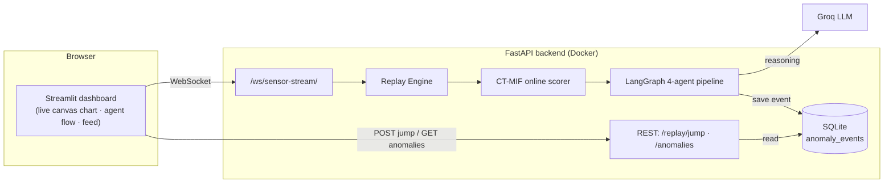
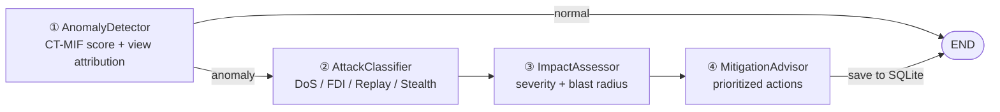

# CT-MIF — ICS Anomaly Detection

> Productionized **CT-MIF** (multi-view Isolation-Forest anomaly detection) for the
> SWaT industrial water-treatment testbed, wrapped in a **4-agent LangGraph reasoning
> pipeline** (classify → assess → mitigate), a **FastAPI WebSocket sensor stream** with
> a controllable **Replay Engine**, a local **SQLite** event store, and a **Streamlit**
> dashboard with a live in-browser chart. Packaged with Docker Compose + GitHub Actions CI.

A lean, Python-native portfolio build focused on the LangGraph agents and the CT-MIF
detector — no Node/Next.js, no external database.

---

## Architecture



**Agent pipeline** (downstream agents run only on a confirmed anomaly):



---

## Stack

| Layer | Tech |
|---|---|
| Core ML | CT-MIF — 3-view Isolation Forest + score fusion (`og_pipeline/{pp,train,test}.py`) |
| Online inference | `core/ctmif.py` — causal, one-reading-at-a-time scorer (verified bit-exact vs offline) |
| Agents | LangGraph, 4 agents on **Groq** (`langchain-groq`), deterministic heuristic fallback |
| Backend | FastAPI (REST + WebSocket) |
| Database | SQLite via **SQLAlchemy ORM** (embedded, zero-config) |
| Frontend | **Streamlit** hosting a self-contained live browser component (canvas chart) |
| DevOps | Docker + docker-compose (api + dashboard), GitHub Actions CI |

---

## Repository layout

```
core/ctmif.py          Online CT-MIF scorer (rolling buffers; reproduces training pipeline causally)
og_pipeline/           Original CT-MIF training/eval: pp.py (preprocess) · train.py (3-view IF + fuse) · test.py (offline eval)
agents/                4 agents + LangGraph graph + SWaT domain knowledge
api/main.py            FastAPI app (lifespan: init SQLite + warm models)
api/database.py        SQLAlchemy engine/session + AnomalyEvent model + helpers
api/routes/            stream.py (WS + /replay/jump) · anomalies.py (GET /anomalies)
replay/engine.py       "Live" stream over the SWaT test set: autonomous play + jump-to-attack
streamlit_app.py       Streamlit dashboard (embeds the live in-browser component)
tests/                 pytest: scorer, API, agents, replay + WebSocket
scripts/               extract_sample · build_replay_data
Dockerfile             One image; compose runs it twice (api + dashboard)
docker-compose.yml     Run the whole stack locally (api :8000 + dashboard :8501)
.github/workflows/     ci.yml (pytest)
```

---

## Quickstart

```bash
python -m venv .venv && . .venv/Scripts/activate   # Windows; use bin/activate on *nix
pip install -r requirements.txt
cp .env.example .env        # optional — fill GROQ_API_KEY to enable the LLM agents
```

Trained models live in `artifacts/*.pkl` (committed). To regenerate from the raw dataset:

```bash
python og_pipeline/pp.py data/swat_combined.csv   # preprocess (writes artifacts/, incl. scaler/freq)
python og_pipeline/train.py                        # train 3 Isolation Forests + thresholds
python scripts/build_replay_data.py                # build the full test-split replay file
```

> **Replay data:** the engine streams `data/replay_test.csv.gz` (the full ~486k-row test
> split, built by `scripts/build_replay_data.py`). If that file is absent it falls back to
> the committed `data/sample_readings.json` fixture so the demo still runs.

> **Windows note:** prefix scripts with `PYTHONIOENCODING=utf-8` — the console's cp1252
> codec chokes on the Unicode in some print statements.

Run the two processes (two terminals):

```bash
uvicorn api.main:app --reload                 # http://localhost:8000/docs  (creates ctmif.db)
streamlit run streamlit_app.py                # http://localhost:8501
```

### Or: the whole stack with Docker Compose

```bash
docker compose up --build                     # api :8000 + dashboard :8501
```

Both services run from one image (different start commands). The dashboard's live
component talks to the API from the **browser**, so it targets `localhost:8000`; the
SQLite DB is persisted in a named volume. Drop a `GROQ_API_KEY` in `.env` to enable the
LLM agents (otherwise they use the heuristic fallback).

---

## The CT-MIF detector

`train.py` builds three Isolation-Forest "views" — raw+temporal sensor features (View A),
PCA + actuator-state surprise (View B), and step-over-step change (View C) — then fuses,
smooths, and thresholds their normalized scores.

`core/ctmif.py` reproduces that pipeline **causally**, one reading at a time, using rolling
buffers for the 60-row rolling-std, the step-difference, and the smoothing window. It is
**verified bit-exact** against the offline batch (max diff `5e-7`, 100 % prediction
agreement over 3 000 rows). Live point-wise performance: **P ≈ 0.68, R ≈ 0.64**, 25/35
attack segments detected — solid for a real-time detector. (The paper's headline F1 relies
on non-causal point-adjustment, which a live system can't use, so it's intentionally
omitted here.)

False positives near attack onset / on a cold start are handled in the **replay layer**
(silent warm-up after a jump + confirm-after-3 / clear-after-20 debounce), keeping the
verified detector untouched.

---

## API

| Method | Path | Purpose |
|---|---|---|
| WS | `/ws/sensor-stream` | Broadcast live scored readings + anomaly events (no client commands) |
| POST | `/replay/jump` | Jump the replay engine to the next detected attack |
| GET | `/anomalies?severity=&limit=&offset=` | Paginated anomaly events (SQLite) |
| GET | `/anomalies/{id}` | Full 4-agent report for one event |
| GET | `/health` | Model / Groq status |

When the MitigationAdvisor (final agent) completes, the engine persists the event to
SQLite via SQLAlchemy; the dashboard's history reads it back through `GET /anomalies`.

---

## Testing

```bash
pytest tests/ -v        # scorer, API, agents (heuristic), replay + WebSocket
```

Tests run without any secrets: SQLite needs no configuration and, with no `GROQ_API_KEY`,
the agents fall back to deterministic heuristics (the tests assert that path). With
`GROQ_API_KEY` set they exercise the live LLM path.

---

## CI

`.github/workflows/ci.yml` runs on every push / PR to `main`:

1. Checkout (includes the committed `artifacts/*.pkl` models + `data/sample_readings.json`).
2. Set up Python 3.12, `pip install -r requirements.txt`.
3. `pytest tests/ -v` — fully self-contained and deterministic (no secrets → heuristic
   agents, SQLite auto-created).

**Reproduce CI locally:** `pytest tests/ -v` · **build the image:** `docker compose build`

---

## Security

Never commit real secrets. The backend reads `.env` (gitignored). The only secret is the
optional `GROQ_API_KEY`; if it leaks, rotate it in the Groq console. The SQLite file
(`ctmif.db`) is gitignored and created at runtime.

---

## Résumé bullet

> Productionized a published CT-MIF anomaly-detection framework with a 4-agent LangGraph
> reasoning pipeline (attack classification → impact assessment → mitigation) on Groq, a
> FastAPI WebSocket sensor stream, a Replay Engine for controlled attack-scenario demos, a
> SQLite/SQLAlchemy event store, and a Streamlit dashboard with a live in-browser chart;
> containerized with Docker Compose and tested in GitHub Actions CI.
